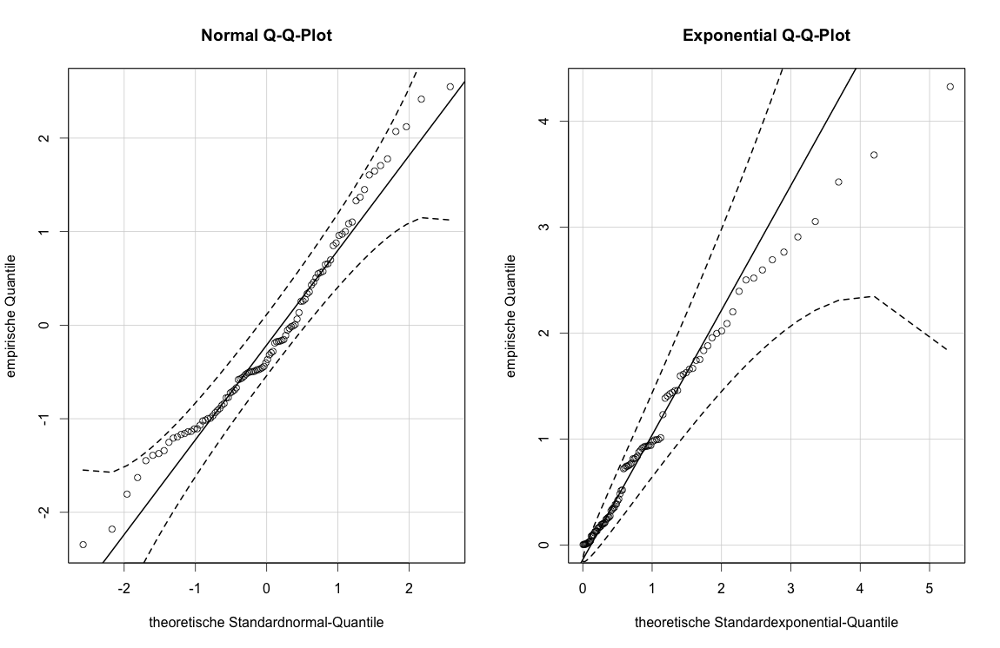

[](http://quantlet.de/)

## [](http://quantlet.de/) **SRM_fig2.16** [](http://quantlet.de/)

```yaml

Name of Quantlet : SRM_fig2.16

Published in : SRM - Stochastische Risikomodellierung und statistische Methoden

Description : 'Produces the QQ plots for simulated samples of standard normal distribution and
exponential distribution with sample size 100. QQ-plots compare empirical quantiles of a
distribution with theoretical quantiles of the standard normal distribution .'

Keywords : 'qq-plot, simulation, normal, normal distribution, exponential, plot, graphical
representation'

Author : Ulrich Wellisch

Example : 'Q-Q-Normal-Plots for simulated samples of standard normal distribution and exponential
distribution.'

```




### R Code:
```r

## clear history
rm(list = ls(all = TRUE))
graphics.off()

## install and load packages
libraries = c("car")
lapply(libraries, function(x) if (!(x %in% installed.packages())) {
  install.packages(x)
})
lapply(libraries, library, quietly = TRUE, character.only = TRUE)

## Stichproben erzeugen Fuer Reproduktion mit fester seed
set.seed(1234)
x = rnorm(100)
set.seed(1234)
y = rexp(100)

par(mfrow = c(1, 2))

## col.lines=palette()[1] schwarze Sollgerade und KI
qqPlot(x, dist = "norm", envelope = 0.99, col = palette()[1], col.lines = palette()[1], 
       main = "Normal Q-Q-Plot", xlab = "theoretische Standardnormal-Quantile", 
       ylab = "empirische Quantile")

qqPlot(y, dist = "exp", envelope = 0.99, col = palette()[1], col.lines = palette()[1], 
       main = "Exponential Q-Q-Plot", xlab = "theoretische Standardexponential-Quantile", 
       ylab = "empirische Quantile")

```
