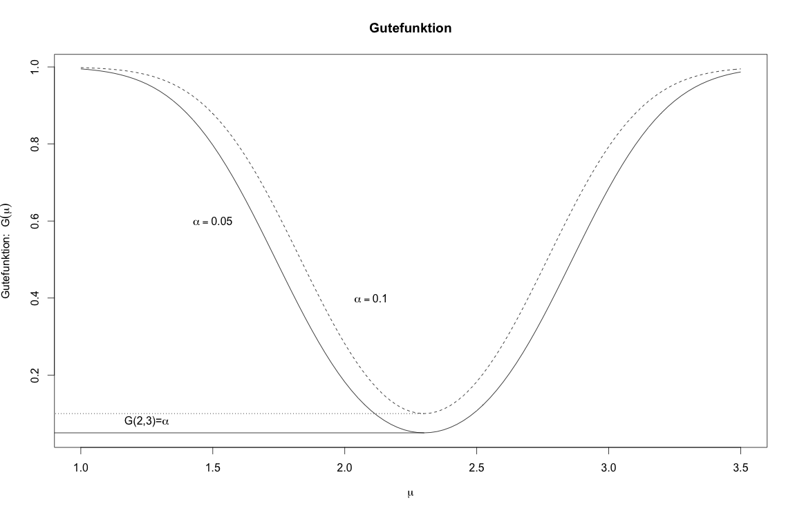

##  **SRM_fig4.2**


```yaml


Name of QuantLet : SRM_fig4.2

Published in : SRM

Description : 'Plots the power functions of t test, with
fixed u= 2.3 and different significant levels.'

Keywords : 't distribution, test, plot, student, Student,
graphical representation'

See also : 

Author : Sandor

Submitted :

Datafile : 

Example :
- 'The power function of t test.'
```



```R

## clear history
rm(list = ls(all = TRUE))
graphics.off()

## Bild Gutefunktion
par(mfrow = c(1, 1))
WertMu0   = 2.3    #Erwartungswert in der Nullhypothese
WertSigma = 1.672  #Bekannte Standardabweichung
WertN     = 36
Alpha1    = 0.05   #Signifikanzniveau
U1        = qt(1 - Alpha1/2, WertN - 1)                          #Quantil
Lambda    = function(mu) sqrt(WertN) * (mu - WertMu0)/WertSigma  #Erwartungswert von T

## Definition der Funktion G
Fehler1 = function(mu) 1 - pt(U1, WertN - 1, Lambda(mu)) + 
pt(-U1, WertN - 1, Lambda(mu))

## Zeichnung von Funktion G
curve(Fehler1, 1, 3.5, 
ylab = expression(paste("Gutefunktion:  ", G(mu))), 
xlab = expression(mu))

## Wie oben mit einem zweiten Signifikanzniveau
Alpha2  = 0.1
U2      = qt(1 - Alpha2/2, WertN - 1)
Fehler2 = function(mu) 1 - (pt( U2, WertN - 1, Lambda(mu)) - 
pt(-U2, WertN - 1, Lambda(mu)))

curve(Fehler2, 1, 3.5, add = TRUE, lty = 2)

## Beschriftung obere Funktion
text(1.5, 0.6, expression(alpha == 0.05))
## Beschriftung untere Funktion
text(2.1, 0.4, expression(alpha == 0.1))
segments(0, 0.05, 2.3, 0.05)        
segments(0, 0.1, 2.3, 0.1, lty = 3) 
text(1.25, 0.08, expression(paste("G(2,3)=", alpha)))
title("Gutefunktion")

```
