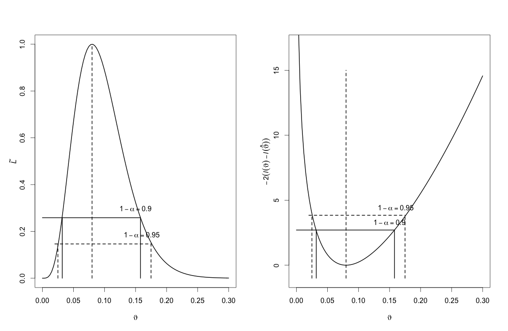

[](http://quantlet.de/)

## [](http://quantlet.de/) **SRM_fig4.6** [](http://quantlet.de/)

```yaml

Name of Quantlet : SRM_fig4.6

Published in : SRM - Stochastische Risikomodellierung und statistische Methoden

Description : 'Plots and compares the confidence intervals for relative likelihood and relative
log-likelihood functions.'

Keywords : confidence-interval, likelihood, function, plot, visualization, graphical representation

Author : Viktor Sandor

Example : 'Plots the confidence intervals for relative likelihood and relative log-likelihood
functions.'

```




### R Code:
```r

## clear history
rm(list = ls(all = TRUE))
graphics.off()

## Konfidenzintervalle mit dem LQT
y      = 4                             # 4 treffer bei 50 Beobachtungen
n      = 50
p_Dach = y/n                           # ML-Schaetzer fur Binomialverteilung

## Funktionen
L  = function(p) p^y * (1 - p)^(n - y) #Likelihood
LR = function(p) L(p)/L(p_Dach)        #Relative Likelihood

par(mfrow = c(1, 2))
## Zeichne Relative Likelihood
curve(LR, 0, 0.3, ylab = NA, xlab = expression(italic(theta1)), lwd = 2)
mtext(expression(tilde(italic(L))), side = 2, line = 2)
segments(0.08, 0, 0.08, 1, lty = 2, lwd = 2)     #Vertikale in p-Dach
c1 = exp(-qchisq(0.95, 1)/2)                     #c1=95% Quantil der Chi^2_1
c2 = exp(-qchisq(0.9, 1)/2)                      #c2=90% Quantil der Chi^2_1
segments(0.02, c1, 0.175, c1, lty = 2, lwd = 2)  #Horizontale in c1
segments(0, c2, 0.158, c2, lty = 1, lwd = 2)     #Horizontale in c2
segments(0.032, 0, 0.032, c2, lwd = 2)           #Vertikale 1 zu c2\t
segments(0.158, 0, 0.158, c2, lwd = 2)           #Vertikale 2 zu c2
segments(0.025, 0, 0.025, c1, lwd = 2, lty = 2)  #Vertikale 1 zu c1
segments(0.175, 0, 0.175, c1, lwd = 2, lty = 2)  #Vertikale 2 zu c1
text(0.15, c2 + 0.04, expression(1 - alpha == 0.9))
text(0.16, c1 + 0.04, expression(1 - alpha == 0.95))
# text(0.01,c1,expression(lambda[alpha]))

## Zeichne Relative Log-Likelihood
LLR = function(p) -2 * log(LR(p), base = exp(1))
curve(LLR, 0, 0.3, ylab = NA, xlab = expression(italic(theta1)), lwd = 2, 
      ylim = c(-1, 17))
mtext(expression(-2(italic(l)(theta1) - italic(l)(hat(theta1)))), side = 2, 
      line = 2)

segments(0.08, -1, 0.08, 15, lty = 2, lwd = 2)    #Vertikale in p-Dach
c1 = qchisq(0.95, 1)                              #c1=95% Quantil der Chi^2_1
c2 = qchisq(0.9, 1)                               #c2=90% Quantil der Chi^2_1
segments(0.02, c1, 0.175, c1, lty = 2, lwd = 2)   #Horizontale in c1
segments(0, c2, 0.158, c2, lty = 1, lwd = 2)      #Horizontale in c2
segments(0.032, -1, 0.032, c2, lwd = 2)           #Vertikale 1 zu c2\t
segments(0.158, -1, 0.158, c2, lwd = 2)           #Vertikale 2 zu c2
segments(0.025, -1, 0.025, c1, lwd = 2, lty = 2)  #Vertikale 1 zu c1
segments(0.175, -1, 0.175, c1, lwd = 2, lty = 2)  #Vertikale 2 zu c1
text(0.15, c2 + 0.6, expression(1 - alpha == 0.9))
text(0.16, c1 + 0.6, expression(1 - alpha == 0.95))

```
